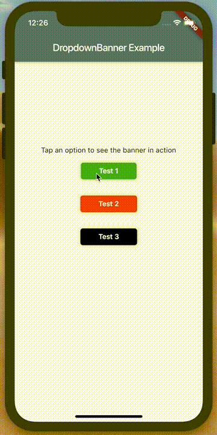

# dropdown_banner
DropdownBanner manages the creation and animation of banner ui elements
that are useful for displaying warnings and updates to users. It is simple to use and effective at event communication.



## Getting Started
Using the dropdown banner is quite intuitive and simple. Below is a quick example of how to use it!

#### In your main.dart when creating the app
```dart
import 'packages:dropdown_banner/dropdown_banner.dart';
...
class MainApp extends StatelessWidget {
  ...
  @override
  Widget build(BuildContext context) {
    ...
    return MaterialApp(
        ...
        home: DropdownBanner(
          builder: (context) => Scaffold(...),
        ),
    );
  }
}
```

#### Generate a banner event
```dart
import 'packages:dropdown_banner/dropdown_banner.dart';
...
class SomeClass {
  ...
  void doSomethingThenFail() {
    DropdownBanner.showBanner(
      text: 'Failed to complete network request',
      color: SKColors.warning_red,
      textStyle: TextStyle(color: Colors.white),
    );
  }
}
```

## Planned improvements
If this package gets any traction, I plan to add support for images, custom widgets, animation duration.. etc. If you have any ideas for making this package more applicable, just open an issue!

## Other info
This package uses another of my packages, [dart_notification_center](https://pub.dev/packages/dart_notification_center), for implementing the observer pattern. This is what makes using the banner so simple! Check it out if you find a need for it.
